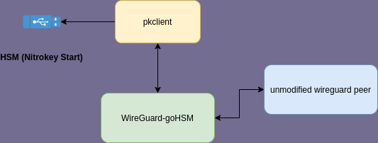

# Go Implementation of [WireGuard](https://www.wireguard.com/)

This is a modification to the wireguard-go implementation to enable the use of an HSM with wireguard.

# background

This project modifies the staticidentity for a 'private key' to enable it to use an hsm when sharedsecret operation is called. 
This enables moving the ECDH key derivation function to an HSM instead of perform on the computer in software.

In the HSM mode, wireguard and the whole operating system doesn't have direct access to the private key, the key is safely stored on the hsm.

## module diagarm



## impact
Benchmarking the sharedSecret function in software vs the HSM shows an added delay of around 73ms

	HSM avg time in ms:      74.663
	Software avg time in ms: 1.823

## Usage

The only implementation currently is in go, there isn't a kernel implementation of this work yet.
```
$ wireguard-go wg0
```

This will create an interface and fork into the background. To remove the interface, use the usual `ip link del wg0`, or if your system does not support removing interfaces directly, you may instead remove the control socket via `rm -f /var/run/wireguard/wg0.sock`, which will result in wireguard-go shutting down.

To run wireguard-go without forking to the background, pass `-f` or `--foreground`:

```
$ wireguard-go -f wg0
```

When an interface is running, you may use [`wg(8)`](https://git.zx2c4.com/wireguard-tools/about/src/man/wg.8) to configure it, as well as the usual `ip(8)` and `ifconfig(8)` commands.

To run with more logging you may set the environment variable `LOG_LEVEL=debug`.

## Platforms

### Linux

This will run on Linux; however you should instead use the kernel module, which is faster and better integrated into the OS. See the [installation page](https://www.wireguard.com/install/) for instructions.

### macOS

This runs on macOS using the utun driver. It does not yet support sticky sockets, and won't support fwmarks because of Darwin limitations. Since the utun driver cannot have arbitrary interface names, you must either use `utun[0-9]+` for an explicit interface name or `utun` to have the kernel select one for you. If you choose `utun` as the interface name, and the environment variable `WG_TUN_NAME_FILE` is defined, then the actual name of the interface chosen by the kernel is written to the file specified by that variable.

### Windows

This runs on Windows, but you should instead use it from the more [fully featured Windows app](https://git.zx2c4.com/wireguard-windows/about/), which uses this as a module.

### FreeBSD

This will run on FreeBSD. It does not yet support sticky sockets. Fwmark is mapped to `SO_USER_COOKIE`.

### OpenBSD

This will run on OpenBSD. It does not yet support sticky sockets. Fwmark is mapped to `SO_RTABLE`. Since the tun driver cannot have arbitrary interface names, you must either use `tun[0-9]+` for an explicit interface name or `tun` to have the program select one for you. If you choose `tun` as the interface name, and the environment variable `WG_TUN_NAME_FILE` is defined, then the actual name of the interface chosen by the kernel is written to the file specified by that variable.

## Building

This requires an installation of [go](https://golang.org) ≥ 1.18.

```
$ git clone https://git.zx2c4.com/wireguard-go
$ cd wireguard-go
$ make
```

## License

    Copyright (C) 2017-2022 WireGuard LLC. All Rights Reserved.
    
    Permission is hereby granted, free of charge, to any person obtaining a copy of
    this software and associated documentation files (the "Software"), to deal in
    the Software without restriction, including without limitation the rights to
    use, copy, modify, merge, publish, distribute, sublicense, and/or sell copies
    of the Software, and to permit persons to whom the Software is furnished to do
    so, subject to the following conditions:
    
    The above copyright notice and this permission notice shall be included in all
    copies or substantial portions of the Software.
    
    THE SOFTWARE IS PROVIDED "AS IS", WITHOUT WARRANTY OF ANY KIND, EXPRESS OR
    IMPLIED, INCLUDING BUT NOT LIMITED TO THE WARRANTIES OF MERCHANTABILITY,
    FITNESS FOR A PARTICULAR PURPOSE AND NONINFRINGEMENT. IN NO EVENT SHALL THE
    AUTHORS OR COPYRIGHT HOLDERS BE LIABLE FOR ANY CLAIM, DAMAGES OR OTHER
    LIABILITY, WHETHER IN AN ACTION OF CONTRACT, TORT OR OTHERWISE, ARISING FROM,
    OUT OF OR IN CONNECTION WITH THE SOFTWARE OR THE USE OR OTHER DEALINGS IN THE
    SOFTWARE.
